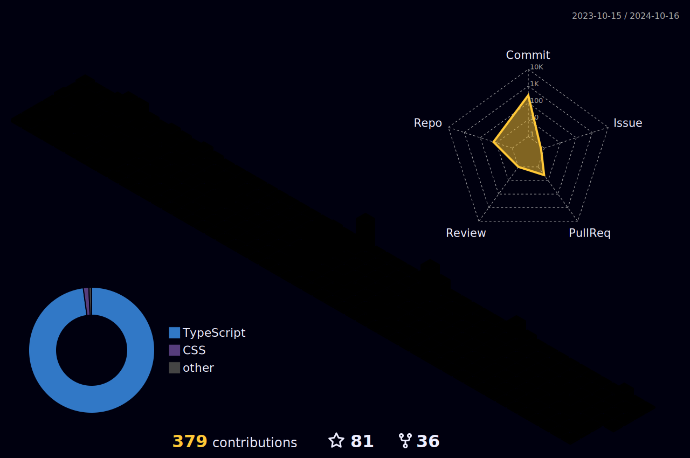

# Hey there! I'm Christopher Teles 👋

**Web developer with a degree in Systems Analysis, experience in administration and solid knowledge of JavaScript, HTML and CSS.**

---

## 📈 GitHub Stats

  
  

 

  

 

  

